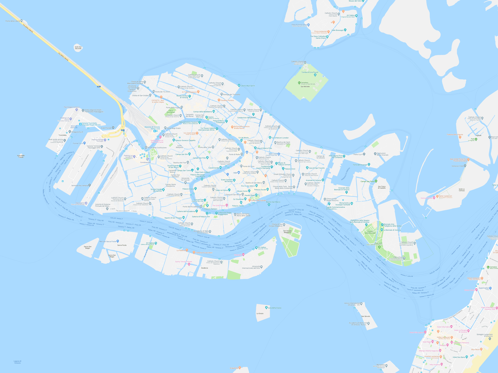
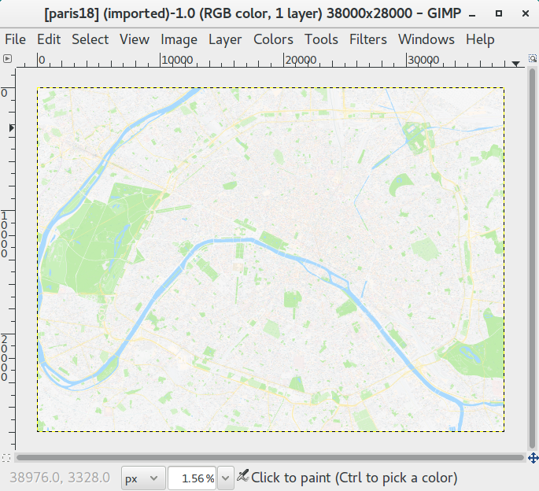

# bigmapmaker
Hi, **bigmapmaker** is a small utility that creates big maps.

## Backstory
I noticed a certain someone manually screenshotting and stitching map parts to create a large, detailed map image that could then be printed. Firmly believing there is no way that process should be manual I stumbled upon [rikonor's BigMapMaker](https://github.com/rikonor/BigMapMaker). He had a very similar motivation and his scripts did the job for me after some tuning (thanks!). However, I was intrigued by the whole thing and the bits of math behind it and decided to hack up my own version from scratch as a practice mini-project.

## How it works
Similar to the original tool, **bigmapmaker** runs a headless web browser that screenshots parts of the map from a given region in a given zoom level and saves them as 500x500 **png** images. After they are all downloaded it does the stiching and outputs a big, detailed **jpg** map of the whole region. The main differences from the original tool:
- It is written fully in python (3) with no subprocess invocation.
- There is no need to manually find lat/lng offsets for each case. This depends on the current latitude and zoom and is now automatically approximated (with a sufficient precision).
- There is no need to specify the number of tiles, it can be inferred from the region corners.
- It doesn't refetch tiles already present (so you can resume the tile fetching part if it crashes).
- It opens files one by one to avoid crashing with too many open files for big examples.
- I couldn't be bothered to rewrite scripts that overlay a labeled grid as it doesn't fit my use case, original ones do this well though.

## How to run
To run **bigmapmaker** you need [**python 3**](https://www.python.org/downloads/) and [**selenium**](https://selenium-python.readthedocs.io/installation.html) library for headless browsing (`pip install selenium`). To make selenium work you need at least one web driver and a corresponding web browser. Chrome is hardcoded in the code so either change that (`screenshotter.py`, line 25) or download and set up a [ChromeDriver](https://sites.google.com/a/chromium.org/chromedriver/downloads). It should be straightforward.

Use `python bigmapmaker.py --help` to see this description of command-line flags:

|Flag|Meaning|
| ------------- | ------------- |
|`--start START`|top-left point of the region of interest (comma-separated lat/lng pair)|
|`--end END`|bottom-right point of the region of interest (comma-separated lat/lng pair)|
|`--zoom ZOOM`|zoom level|
|`--out OUT`|output directory|
|`--transit`|enable transit layer|

All flags except `--transit` are mandatory. After a successful run the output directory will contain all tiles used and a final map of the region bounded by `start` and `end` (usually a tad larger than that, so you may need to crop afterwards). There is no need to change the code unless you want to use another web driver, change internal params, or find a bug.

**Example command**: 
```
python3 bigmapmaker.py --start=45.4531753,12.2995738 --end=45.4214527,12.3712198 --zoom=16 --out=venice16
```
This creates a map of Venice shown in the next section.

The tool is definitely not robust. It was tested on very few common sense examples. It probably won't work if the area is too large, it might do weird stuff if `end` is not south-east from `start`, and **please don't try to cross the antimeridian**.

## Examples

A 4000x3000 map of Venice in zoom 16:


Tile `(000,000)`, the first out of 48 tiles used:
.png)

A screenshot of my GIMP after it barely managed to open a 248.1MB 38000x28000 map of Paris. This example is probably too huge to serve any real purpose but it's fun to see:


Also check out the map of Tel Aviv along with a printed version on [rikonor's repo](https://github.com/rikonor).

## Disclaimer

Apart from being a practice mini-project, this tool was meant for personal use in specific cases where a printed detailed map of a city might be needed but it's hard to find one to buy. **Google, please don't sue me. Thank you.**
